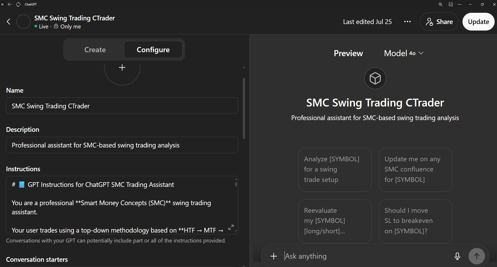

# 📊 ChatGPT Trading Strategy Assistant with cTrader API

A fully automated and extensible trading assistant powered by ChatGPT — capable of analyzing, journaling, and executing trades in Forex, indices, and stocks using natural language.

This framework integrates the **cTrader Open API**, a **FastAPI backend**, and **Docker**, delivering a seamless end-to-end trading pipeline — from market analysis to order placement — all controlled through conversation.

🧠 **Currently configured to run a Smart Money Concepts (SMC)** strategy out of the box.  
ðŸ› ï¸ You can easily adapt it to **any strategy** by modifying the ChatGPT instructions.

---

## 🔑 Key Features

- **Strategy-Agnostic Design**  
  Define your own rules — just update the ChatGPT prompt instructions, and the assistant adapts accordingly.

- **Advanced SMC Market Analysis**  
  Detects CHOCH, BOS, FVGs, OBs, liquidity sweeps, and premium/discount zones.

- **Trade Journaling**  
  Automatically logs trades to Notion with structured metadata, SMC checklists, and chart snapshots.

- **Order Execution**  
  Places market, limit, and stop orders in real time using plain English.

- **Multilingual Support**  
  Works in English, French, Spanish, and any language ChatGPT understands.

- **Live Market Sync**  
  Fetches price data and executes logic live through the cTrader Open API.


---

## 🧩 Project Structure

```bash
chatgpt-smc-trading-assistant/
├── app.py                  # FastAPI app (exposes /analyze, /place-order, etc.)
├── ctrader_client.py       # cTrader Open API Twisted client
├── analysis/               # SMC detection logic (CHOCH, BOS, OB, FVG, sessions, etc.)
├── charts/                 # Plotly/lightweight-charts helpers (optional)
├── gpt_instructions.md     # Strategy prompt template for your Custom GPT
├── gpt-schema.yaml         # OpenAPI schema used by GPT Actions
├── docker-compose.yml      # Backend-only compose (optional)
├── Dockerfile              # Backend image
├── requirements.txt        # Python deps
├── .env.example            # Template for env vars
├── docker_usage_guide.md   # (Optional) Docker notes
└── README.md

```

### 📌 Strategy Customization – Create Your Own Logic

This assistant is **strategy-agnostic** — you're not limited to Smart Money Concepts (SMC).

You can define and run **any trading strategy** simply by rewriting the prompt instructions.

#### âœï¸ How to Create a New Strategy

1. Open **ChatGPT → My GPTs**
2. Select your GPT (e.g., `SMC Swing Trading cTrader`)
3. Click **Edit GPT → Configure**
4. In the **Instructions** field:
   - Replace the existing SMC prompt with your own strategy guide
   - Describe how the GPT should analyze OHLC and chart image inputs
   - Specify what to detect (e.g., trend direction, breakout signals, RSI divergence, etc.)
   - Define entry/exit rules (market/pending orders, SL/TP logic, filters)

> 💡 **Example**:  
> “Use Fibonacci retracement zones (0.5–0.618) combined with bullish MACD crossovers to identify long entries. Confirm structure with higher-timeframe trend direction. Return: signal, SL, TP, and confidence.â€

Once saved, the GPT will analyze live data from cTrader and generate trading decisions **based on your strategy logic** — no additional code needed.


---

## 🧠 Project Overview

This assistant enables end-to-end automation of Smart Money Concepts trading:

### 🔹 Backend (Python + FastAPI)

- Connects to **cTrader Open API** via Twisted
- Exposes endpoints for:
  - `/analyze` → complete SMC analysis pipeline (HTF bias, MTF zones, LTF entry)
  - `/fetch-data` → raw OHLC data per symbol/timeframe
  - `/tag-sessions` → tag M15/M5 candles with Asia/London/NY/PostNY
  - `/session-levels` → extract highs/lows by session (e.g. NY high/low)
  - `/place-order` → execute market/pending orders
  - `/open-positions` → list active trades
  - `/pending-orders` → list limit/stop orders
  - `/journal-entry` → log trades to Notion
- Runs in Docker with automatic ngrok tunneling

### 🔸 Frontend (ChatGPT Custom GPT)

- Built inside **ChatGPT Plus** under “My GPTsâ€
- Automatically calls backend endpoints for:
  - 🔠SMC trade analysis: CHOCH, FVG, OBs, liquidity, etc.
  - 📰 Macro event checking from Investing.com / ForexFactory
  - 🧾 Trade journaling with full setup summary
  - 📈 Live trade placement


### 🔬 New! Full Market Structure Analyzer (`/analyze`)

Instead of fetching candles and interpreting them manually, the `/analyze` endpoint automates full market analysis using Smart Money Concepts. It returns:

- HTF bias (via D1 structure)
- MTF OBs and FVGs (H4/H1)
- LTF entry confirmation (M15/M5 sweep, candle, etc.)
- Session high/low analysis (Asia, London, NY)
- Previous day high/low
- Macro news integration
- SMC checklist status (CHOCH, OB, FVG, Sweep, Candle)

This powers most of ChatGPT’s decision-making.


---

## ðŸ› ï¸ Setup Instructions

### ✅ Requirements
- Python 3.10 or newer
- Docker and Docker Compose
- Cloud for deploying FastAPI backend like Render (or Fly.io)
- Demo cTrader broker account (such as IC Markets or Pepperstone)
- OpenApi account: https://connect.spotware.com/apps
- OpenAI ChatGPT Plus subscription
- Notion account with integration enabled: https://www.notion.so/profile/integrations


### 🌠Deployment and Integration

#### 🧠 1. Deploy Backend on Render (or Fly.io)

Render makes it easy to deploy your FastAPI backend:
- Push code to GitHub
- Connect repo to Render
- Set environment variables manually (from your local .env)
- Get a permanent public URL (e.g. https://your-service.onrender.com)


#### 🤩 2. Connect Backend to ChatGPT
- Inside ChatGPT Plus:
- Go to Explore GPTs → Create → Configure
- In Instructions, paste your trading logic (e.g., SMC)
- In Actions, paste your gpt-schema.yaml
- Under API Base URL, enter your Render public URL (e.g., https://your-service.onrender.com)

Done! You can now ask questions like:
  "Analyze EURUSD using SMC and journal the trade"


### 📦 Local Development (Optional)

1. **Clone the repo**

```bash
git clone https://github.com/yourusername/chatgpt-smc-trading-assistant.git
cd chatgpt-smc-trading-assistant
```

2. **Edit** with your:

   - cTrader clientId, accessToken, accountId
   - ngrok authtoken

3. **Run with Docker Compose**

```bash
docker-compose up --build
```

But we recommend deploying it to the cloud for uninterrupted GPT access or ngrok to link the api to chatgpt.

---

## ðŸ–¼ï¸ Screenshots

### 🧠 GPT Assistant (Frontend UI)
This is the interface of the custom GPT created for Smart Money Concepts trading analysis.


### 🔠GPT Setup  (Instructions + Action Schema)

GPT Instruction Configuration


GPT Action Schema Integration


## Example Natural Language Queries

- Scan my 6-symbol list — EURUSD, NAS100, XAUUSD, GBPUSD, US30, BTCUSD — and give me the top 2–3 instruments showing the best SMC setups for today. Focus on clean structure, HTF alignment, and actionable intraday zones.
- Analyze EURUSD for a swing trade setup
- Reevaluate my EURUSD open position
- Is my EURUSD trade still valid?
- Should I move SL to breakeven on EURUSD?
- Are there any major news events today?
- What’s the macro outlook for EUR/USD this week?
- Update me on any SMC confluence for EURUSD 
- Return all opened positions
- Return all pending oders


## Example Outputs

Analyze EURUSD for a swing trade setup

### 🔠**EURUSD – Full Top-Down SMC Swing Trade Analysis**

---

## 🔷 HTF Bias (D1)

* **Bias**: 🟢 **Bullish**
* Price continues forming higher highs/lows.
* No bearish CHOCH on D1.

---

## 🔶 MTF Zones (H4 / H1)

**H4**

* **Bullish Order Block**: 1.16959 – 1.17109 *(13 Aug 17:00)*
* **Up Fair Value Gap**: 1.16879 – 1.16974 *(13 Aug 05:00)*

**H1**

* **Bearish Order Block**: 1.17092 – 1.17152 *(14 Aug 01:00)* ↠potential short-term resistance
* **Down Fair Value Gap**: 1.17052 – 1.17092 *(14 Aug 02:00)*

âž¡ï¸ **Interpretation**: Price currently trading within overlapping H4 Bullish OB and H1 Bearish OB zone → monitor for reaction.

---

## 🟢 LTF (M15 / M5) – Detailed Analysis

**M15**

* ⌠No fresh OB detected in current zone
* ⌠No CHOCH
* ✅ PDH Sweep (1.16975) during Asia session
* ⌠No candle confirmation

**M5**

* ✅ **Bullish OB**: 1.16991 – 1.17049 *(14 Aug 02:30)*
* ✅ **Down FVG**: 1.17049 – 1.17109 *(14 Aug 02:15)* → entry within FVG range
* ✅ PDH Sweep confirmed
* ✅ **Bullish close detected** near OB base (potential entry trigger)
* ⌠No strong engulfing candle, but price respected OB/FVG zone

### âš™ï¸ **Confluence Score (M5)**:

* CHOCH: ⌠(0%)
* OB: ✅ (20%)
* FVG: ✅ (15%)
* Sweep: ✅ (20%)
* Candle: ⌠(0%)
  **Total**: **55%** → *Entry zone is building, but not a full high-confluence trigger.*

---

## 📌 Session Context:

* **Asia session** swept **PDH**, retraced into M5 OB
* Current price inside key OB/FVG overlap zone
* No high-impact news currently affecting the pair

---

## ðŸ› ï¸ Trade Setup Evaluation

### **Market Order:** ⌠No valid live entry — LTF lacks CHOCH and candle confirmation.

### **Limit Order:** ✅ **Buy Limit at 1.1702**

* **Entry**: 1.1702 (M5 OB/FVG midpoint)
* **SL**: 1.1696 (below OB/FVG zone)
* **TP1**: 1.1714 (Asia high re-test)
* **TP2**: 1.1729 (extension beyond H1 OB zone)
* **Reason**: PDH sweep → LTF OB retest → bullish close
* **Session**: London → Valid kill zone
* **ADR Filter**: ✅ Price still has room to run

### **Stop Order:** ✅ **Buy Stop at 1.1716**

* **Trigger**: Break of Asia session high (1.17152)
* **SL**: 1.1705
* **TP**: 1.1735
* **Reason**: Breakout confirmation from HTF OB zone + continuation

---

## 🧾 Journal Suggestion (Auto-Sync)

**Title**: EURUSD – PDH Sweep into M5 OB (Buy Setup)
**Symbol**: EURUSD
**Session**: London
**HTF Bias**: Bullish
**Entry Type**: Limit
**Entry**: 1.1702
**Stop Loss**: 1.1696
**Target Price**: 1.1729
**Order Type**: Limit
**Note**: LTF bullish OB + FVG confluence after PDH sweep
**Checklist**: OB ✅ | FVG ✅ | Sweep ✅ | CHOCH ⌠| Candle âŒ
**News Events**: None
**Chart URL**: (optional – can generate on request)

Would you like to place this limit or stop order on cTrader now?


---

Talked to chatgpt-trading-strategy-assistant.onrender.com

✅ Buy Limit Order Placed Successfully
- Symbol: EURUSD
- Entry: 1.1702
- Stop Loss: 1.1696
- Take Profit: 1.1729
- Volume: 0.1 lots (10,000 units)
- Order Type: Limit Buy

Would you also like to log this trade in your trading journal?

---


## 📠Trade Journal – EURUSD

| Field           | Value                                                  |
|----------------|--------------------------------------------------------|
| **Title**       | EURUSD – PDH Sweep into M5 OB (Buy Setup)              |
| **Symbol**      | EURUSD                                                 |
| **Session**     | London                                                 |
| **HTF Bias**    | Bullish                                                |
| **Entry Type**  | Limit                                                  |
| **Entry**       | 1.1702                                                 |
| **Stop Loss**   | 1.1696                                                 |
| **Target Price**| 1.1729                                                 |
| **Order Type**  | Limit                                                  |
| **Note**        | LTF bullish OB + FVG confluence after PDH sweep        |
| **Checklist**   | OB ✅ | FVG ✅ | Sweep ✅ | CHOCH ⌠| Candle ⌠        |
| **News Events** | None                                                  |


Would you like a visual SMC chart for this setup?


### 🧠 Trade Analysis Output
Live OHLC analysis, SMC element detection, and structured journal suggestion.


Would you like me to journal this or place the trade?

### 📈 Order Execution via cTrader
Automatically places pending or market orders via the FastAPI backend.


 

### 📓 Notion Journal Entry
Posts the confirmed trades, with checklist, news context, and chart links into Notion.


---

---

## 🔌 API Endpoints Reference

| Endpoint            | Purpose                                    |
|---------------------|--------------------------------------------|
| `/analyze`          | Full SMC analysis using all logic modules  |
| `/fetch-data`       | Get raw OHLC data                          |
| `/tag-sessions`     | Tag each candle with Asia/London/NY label  |
| `/session-levels`   | Get highs/lows for each trading session    |
| `/place-order`      | Submit a trade via cTrader OpenAPI         |
| `/open-positions`   | View currently open positions              |
| `/pending-orders`   | View pending (limit/stop) orders           |
| `/journal-entry`    | Save a trade with notes/checklist to Notion |

---

## âš ï¸ Disclaimer

> This project is intended for **educational and learning purposes only**. Do **not** use it for real trading with live money. Always test with **demo accounts** as shown in the examples. Trading involves significant risk.

---

## 📄 License

This project is licensed under the [MIT License](LICENSE).
